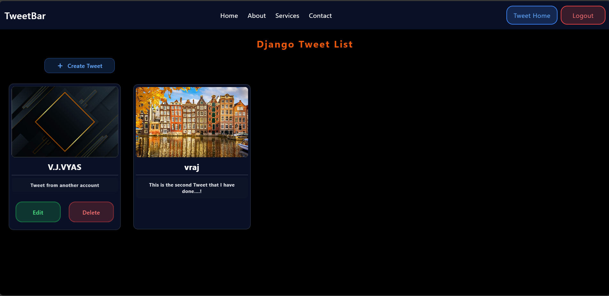

# Django TweetApp

Django TweetApp is a modern web application that allows users to create, edit, and delete tweets in real-time. Built with Django and leveraging the power of modern web technologies, it provides a smooth and responsive user experience across different devices.


## Live Images For Laptop





## Getting Started

Follow these steps to set up the project on your local machine:

1. **Fork the Repository:**
   - Click on the "Fork" button at the top right corner of this repository's GitHub page.

2. **Clone the Forked Repository:**
   ```bash
   git clone https://github.com/VrajVyas11/Django_TweetApp.git
   ```

3. **Navigate to the Project Directory:**
   ```bash
   cd Django_TweetApp
   ```

4. **Install Dependencies:**
   Ensure you have Python and pip installed, then create a virtual environment and install the dependencies:
   ```bash
   python -m venv venv
   source venv/bin/activate  # On Windows use venv\Scripts\activate
   pip install -r requirements.txt
   ```

5. **Set Up Environment Variables:**
   Create a `.env` file in the root directory and add the necessary environment variables as specified in `.FakeENV`.

6. **Run Migrations:**
   ```bash
   python manage.py migrate
   ```

7. **Start the Development Server:**
   ```bash
   python manage.py runserver
   ```

8. **Open Your Browser:**
   Navigate to http://localhost:8000 to see the application running.
